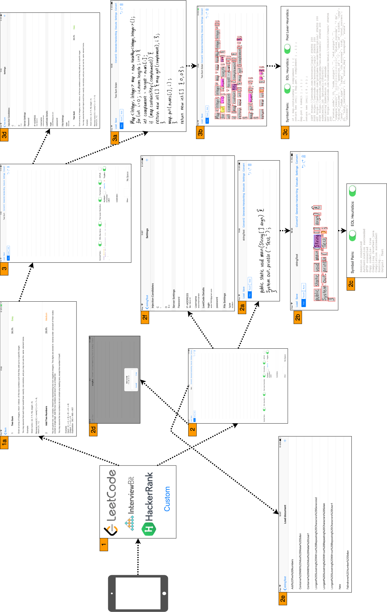

## What is this fork about?

This is my individual project as part of my undergraduate degree at Imperial College London.

I have used the MyScript handwriting engine to create an iOS application to help developers prepare for their technical interviews. The app allows users to handwrite source code using the Apple Pencil on an iPad. The handwriting is recognised by the MyScript engine, and then post processed by my pipeline to correct recognition errors. The post processing pipeline is built around ANTLR and uses a number of strategies to navigate the source code. A bunch of usability features have also been included in this project: loading and saving digital ink files along with recognised output, allowing intermittent conversions, manual user fixes, third party integration with LeetCode...

For more information please refer to my [slides](https://github.com/solan1803/interactive-ink-examples-ios/blob/ANTLR-Symbol-Table/FinalYearProjectPresentationSlides.pdf) and [report](https://github.com/solan1803/interactive-ink-examples-ios/blob/ANTLR-Symbol-Table/FinalYearProjectReport.pdf)

Below are some screenshots: 




## What is it about?

Interactive Ink SDK is the best way to integrate handwriting recognition capabilities into your iOS application. Interactive Ink extends digital ink to allow users to more intuitively create, interact with, and share content in digital form. Handwritten text, mathematical equations or even diagrams are interpreted in real-time to be editable via simple gestures, responsive and easy to convert to a neat output.

This repository contains a "get started" (in both Objective-C and Swift), a complete example (in Objective-C) and a reference implementation of the iOS integration part (in Objective-C) that developers using Interactive Ink SDK can reuse inside their projects.

## Getting started

### Prerequisites

This getting started section has been tested with Xcode 9 and supports iOS 9+.
[Cocoapods](https://guides.cocoapods.org/using/getting-started.html#toc_3) needs to be installed on your computer.

### Installation

1. Clone the examples repository  `git clone https://github.com/MyScript/interactive-ink-examples-ios.git`

2. Claim a certificate to receive the free license to start develop your application by following the first steps of [Getting Started](https://developer.myscript.com/getting-started)

3. Copy this certificate to `Examples/GetStarted/GetStarted/MyScriptCertificate/MyCertificate.c`, `Examples/GetStartedSwift/GetStartedSwift/MyScriptCertificate/MyCertificate.c`, and `Examples/iinkSDKIOSExample/iinkSDKIOSExample/MyScriptCertificate/MyCertificate.c`

## Building your own integration

This repository provides you with a ready-to-use reference implementation of the iOS integration part, covering aspects like ink capture and rendering. It is located in `IInkUIReferenceImplementation` directory and can be simply added to your project by appending the following line to your pod file:

```ruby
pod "MyScriptInteractiveInk-UIReferenceImplementation"
```

## Documentation

A complete guide is available on [MyScript Developer website](https://developer.myscript.com/docs/interactive-ink/1.0/ios/).
The API Reference is available directly in Xcode once the dependencies are downloaded.

## Getting support, giving feedback

You can get some support or give feedback from the dedicated section on [MyScript Developer website](https://developer.myscript.com/support/).

## Something to show?

Made a cool app with Interactive Ink? Ready to cross join our marketing efforts? We would love to hear about you!
We’re planning to showcase apps powered by MyScript technology so let us know by sending a quick mail to [myapp@myscript.com](mailto://myapp@myscript.com).

## Contributing

We welcome your contributions:
If you would like to extend those examples for your needs, feel free to fork it!
Please sign our [Contributor License Agreement](CONTRIBUTING.md) before submitting your pull request.
